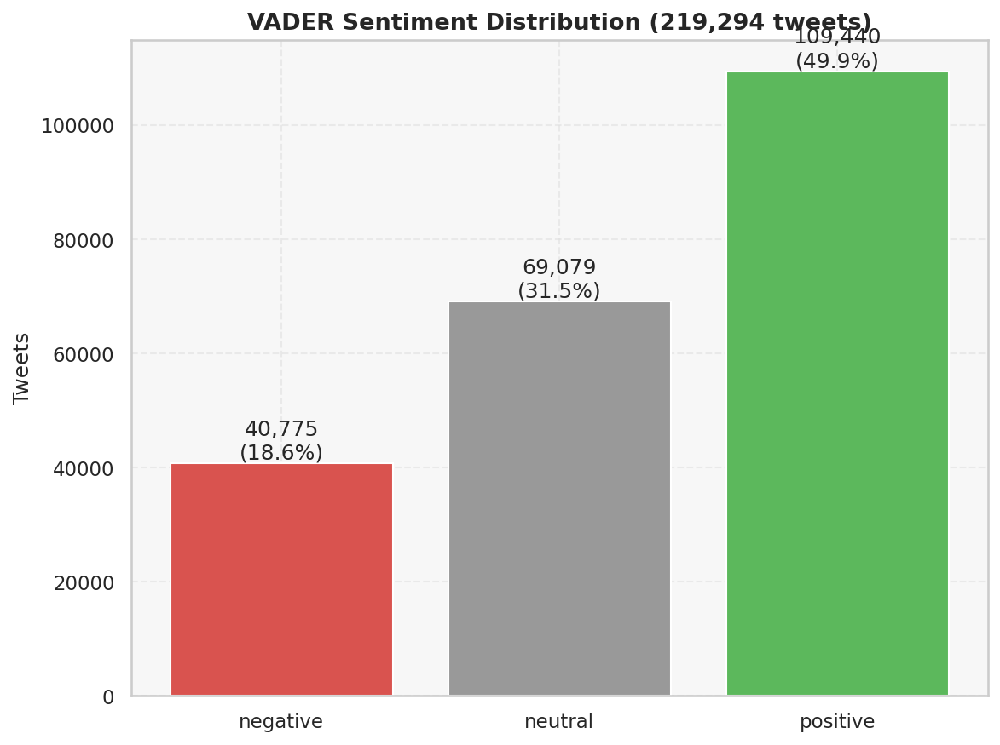
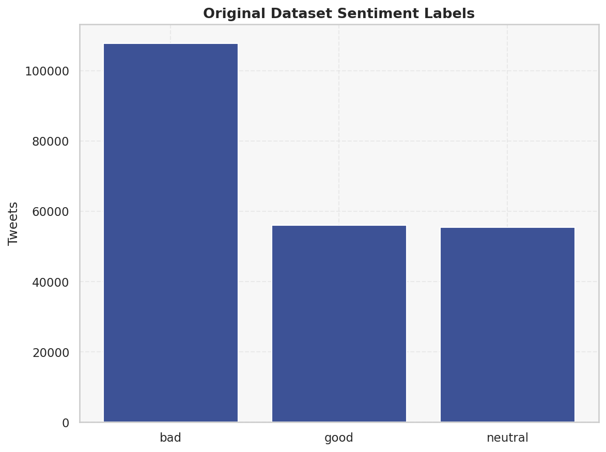
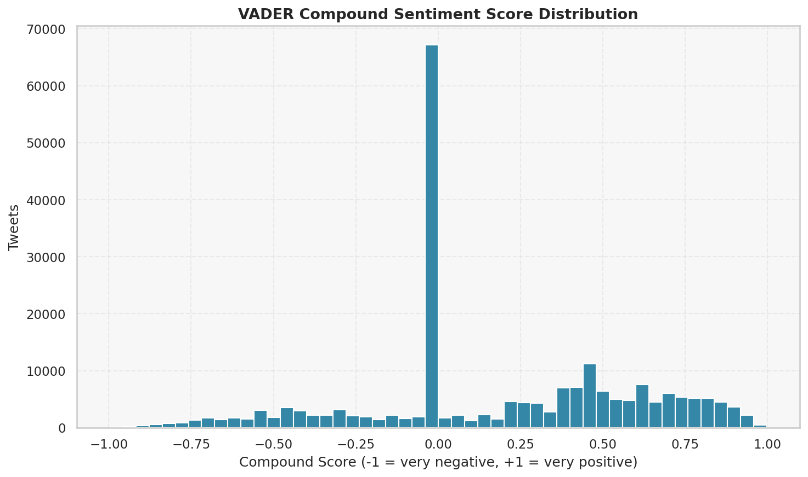
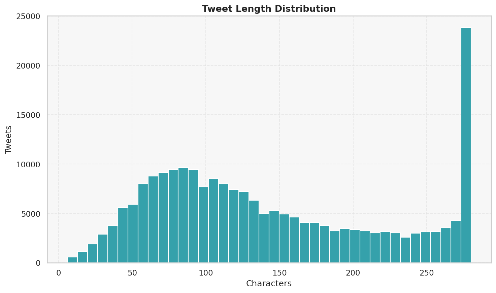
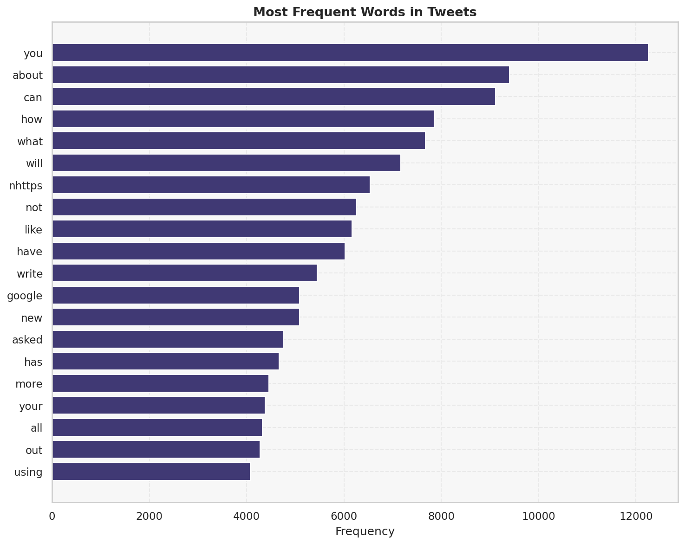
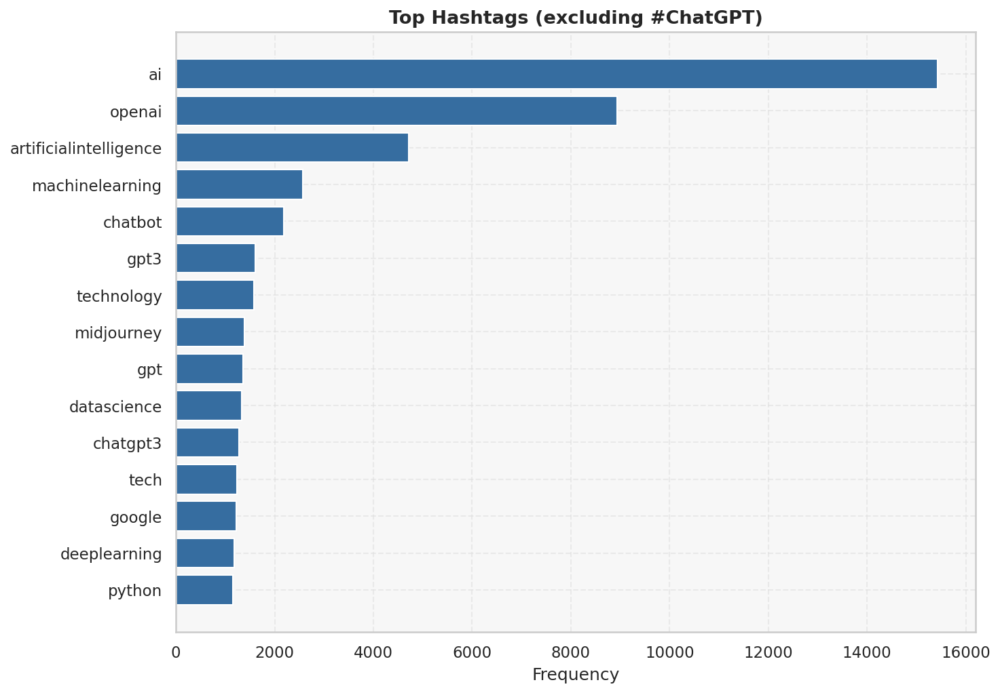
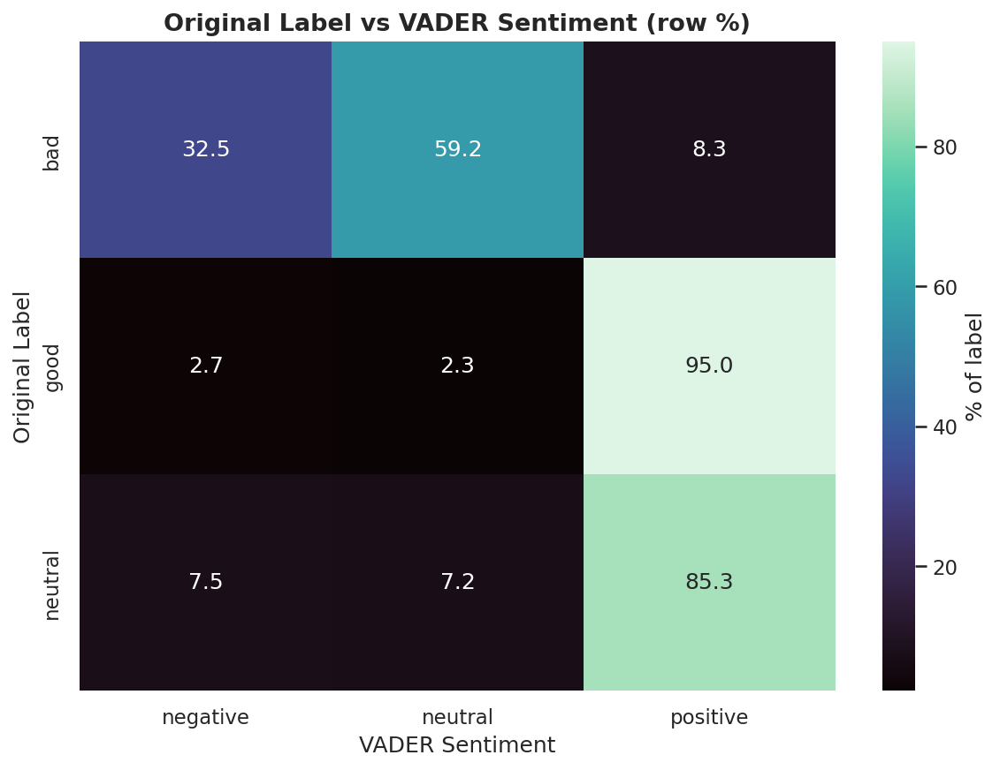
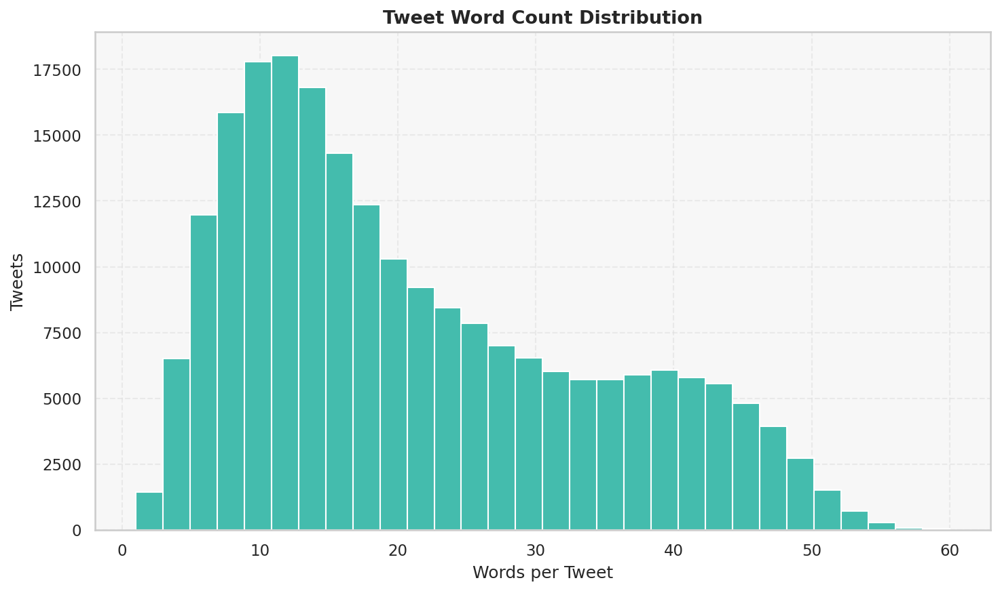
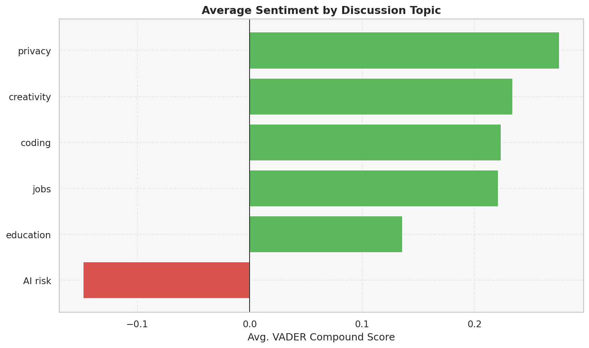
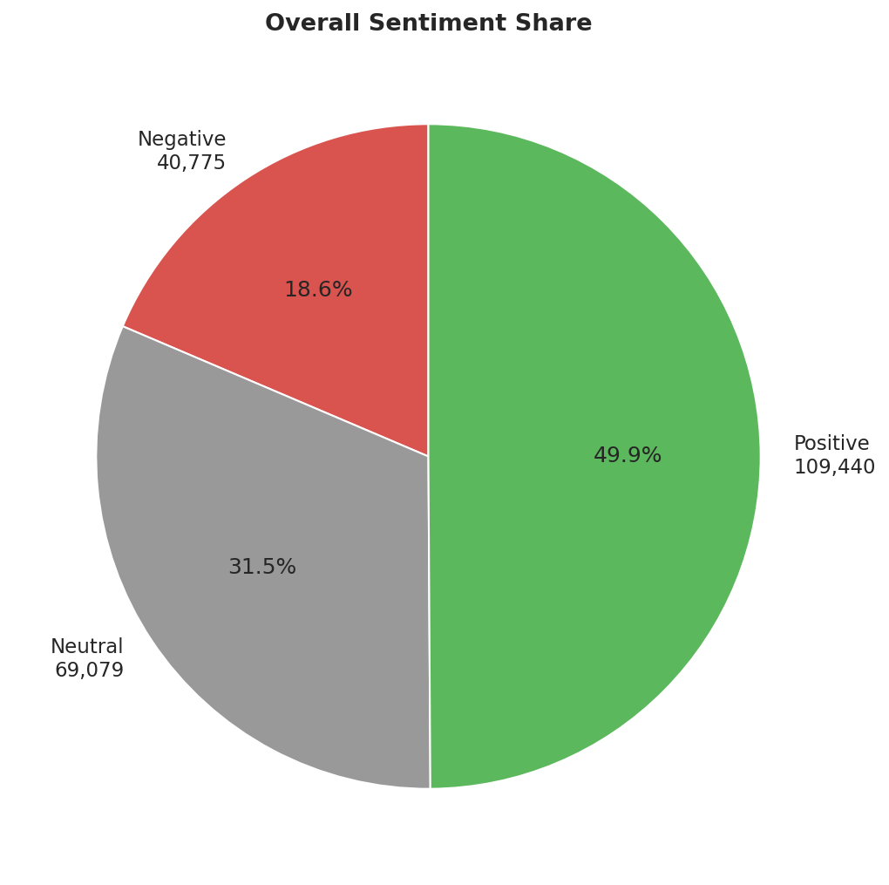

# ChatGPT Twitter Sentiment Analysis (500K Tweets)

Production-style data analytics portfolio project analyzing public sentiment toward ChatGPT on Twitter during January to March 2023.

## Business Problem

ChatGPT created a sudden global conversation around productivity, education, coding, job displacement, privacy, and AI competition. The goal of this project is to turn a large noisy social dataset into decision-ready insights for product, marketing, policy, and executive stakeholders.

## Objectives

- Clean and standardize roughly 500K raw tweets from the Kaggle ChatGPT Twitter dataset.
- Engineer text, engagement, date, geography, account, hashtag, and NLP sentiment features.
- Compare VADER and TextBlob sentiment behavior.
- Build 30+ EDA visuals covering tweet volume, countries, hashtags, users, topics, and sentiment trends.
- Provide SQL analysis practice with 50 interview-level queries.
- Design a Power BI dashboard plan for executive storytelling.

## Dataset

- Source: Kaggle ChatGPT Twitter Dataset
- Period: January to March 2023
- Format: CSV
- Expected file path: `data/raw/chatgpt_tweets.csv`

The raw CSV is intentionally ignored by Git because it is large. Place the Kaggle export in `data/raw/` before running the pipeline.

### CSV Schema

The pipeline maps common tweet export columns into its analysis schema before cleaning.
For the tweet body, use one of these column names:

- `tweet`
- `text`
- `content`
- `full_text`

Optional metadata columns are also detected when present:

- Dates: `date`, `created_at`, `tweet_created`, `timestamp`
- Users: `user`, `username`, `screen_name`, `author`
- Countries: `country`, `user_location`, `location`
- Language: `language`, `lang`

This lets the same workflow analyze the Kaggle export or a smaller CSV exported from
tools such as TweetClaw without editing the code.

## Project Structure

```text
ChatGPT-Twitter-Sentiment/
├── data/
│   ├── raw/
│   └── cleaned/
├── notebooks/
├── sql/
├── src/
├── dashboard/
├── reports/
├── images/
├── README.md
├── requirements.txt
└── .gitignore
```

## Workflow

1. Data ingestion from Kaggle CSV
2. Missing value handling, duplicate removal, language filtering, date formatting
3. URL, HTML, emoji, username, mention, hashtag, stopword, and noise cleanup
4. Tokenization and lemmatization with NLTK
5. Feature engineering for tweet length, word count, hashtags, mentions, sentiment, and time fields
6. VADER and TextBlob sentiment scoring
7. Model comparison using accuracy, precision, recall, F1 score, and confusion matrix
8. EDA visual generation
9. SQL analysis and Power BI dashboard planning

## Tech Stack

Python, Pandas, NumPy, NLTK, TextBlob, VADER, Regex, WordCloud, Matplotlib, Seaborn, Plotly, SQL, Power BI, Jupyter Notebook, Git.

## Installation

```bash
python -m venv .venv
.venv\Scripts\activate
pip install -r requirements.txt
```

## Run the Pipeline

```bash
python -m src.pipeline --raw-path data/raw/chatgpt_tweets.csv
```

Outputs:

- `data/cleaned/chatgpt_tweets_cleaned.csv`
- `data/cleaned/chatgpt_tweets_featured.csv`
- `data/cleaned/sentiment_model_comparison.csv`
- `images/generated/`

## KPIs

- Total tweets
- Daily and monthly tweet growth
- Positive, negative, and neutral sentiment share
- Positive-to-negative sentiment ratio
- Verified vs non-verified tweet share
- Top countries by tweet volume
- Top positive and negative countries
- Most active users
- Most used hashtags
- Most discussed AI companies and models
- Topic trend volume for privacy, job loss, coding, education, and AI risk

## Expected Insights

- Public conversation typically spikes around product announcements, viral demonstrations, school concerns, and competitor announcements.
- Verified users often drive visibility and can differ from broader public sentiment.
- Coding and productivity terms tend to skew more positive, while privacy, misinformation, job loss, and education policy terms often skew more negative or cautious.
- Country-level sentiment can reveal different adoption patterns and policy concerns.

## Screenshots

10 charts generated from a real dataset of 219,294 ChatGPT-related tweets, using VADER sentiment scoring, saved in `images/generated/`.

<table>
<tr>
<td align="center"><br/><sub>Sentiment Distribution</sub></td>
<td align="center"><br/><sub>Original Label Distribution</sub></td>
<td align="center"><br/><sub>Compound Score Histogram</sub></td>
</tr>
<tr>
<td align="center"><br/><sub>Tweet Length Distribution</sub></td>
<td align="center"><br/><sub>Top Words</sub></td>
<td align="center"><br/><sub>Top Hashtags</sub></td>
</tr>
<tr>
<td align="center"><br/><sub>Label Vs Vader Heatmap</sub></td>
<td align="center"><br/><sub>Word Count Distribution</sub></td>
<td align="center"><br/><sub>Sentiment By Topic</sub></td>
</tr>
<tr>
<td align="center"><br/><sub>Sentiment Share Pie</sub></td>
<td></td>
<td></td>
</tr>
</table>

## Dashboard Preview

The Power BI plan is available in `dashboard/powerbi_dashboard_plan.md`. After generating outputs, use `data/cleaned/chatgpt_tweets_featured.csv` as the main fact table.

## Future Improvements

- Add manually labeled sentiment samples for stronger supervised evaluation.
- Add engagement-weighted sentiment using likes, retweets, and replies when available.
- Build a topic model with BERTopic or LDA.
- Add anomaly detection for tweet spike events.
- Deploy a Streamlit dashboard for public portfolio viewing.
